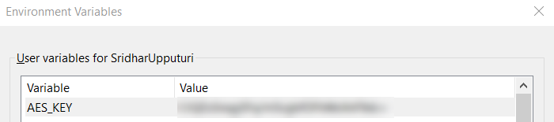

<!-- https://docs.github.com/en/get-started/writing-on-github/getting-started-with-writing-and-formatting-on-github/basic-writing-and-formatting-syntax#relative-links -->

<h1 align="center">Generic Test Automation Framework</h1>


<div align="center">


</div>

## Introduction ##

This is a generic framework for Automation Testing using Selenium WebDriver, Java and TestNG.
This framework is based on Page Object Model (POM) and TestNG. The framework will help in automating web based 
UI applications and API testing. This plug-and-play framework can be used for both API and UI testing.
## Requirements ##

<details>
    <summary>Mandatory requirements</summary>
The minimum configuration that is required to use this framework is

* Java 13
* 8+ gb RAM (Windows)
* Configure the AES_KEY under user environment variables
    
* Read, Write, Delete permission on the folder where the repo will be copied.
* The Latest version of the browsers (Chrome, Firefox, Edge)
* Add Java executable to user environment path variable (make sure you use java executable from JDK but not JRE).

    To test this, try running the command javac. This command won't exist if you only have the JRE installed.
    If you're met with a list of command-line options, you're referencing the JDK properly.
</details>

<details>
<summary>Optional requirements</summary>

* IDE for programming (Eclipse, VS.Code, IntelliJ, or your choice)

</details>


## Key Features ##

<details>
    <summary>Encryption</summary>
    <p> 
Data security is a priority for any organization in the modern world. Hence, this framework provides the option of
encrypting the data using AES algorithm. This will help in keeping the data safe. Please use the below steps
to enable this feature.

1. Generate AES_KEY - Run the [Generate AES_KEY](src/test/java/unittests/encryption/GenerateAesKeyTest.java) file to generate the AES_KEY
2. Store it in the user environment variable as AES_KEY.
   
3. Run the [Encrypt Data](src/test/java/unittests/encryption/EncryptTest.java) file to encrypt the data.
4. Run the [Decrypt Data](src/test/java/unittests/encryption/DecryptTest.java) file to decrypt the data.
</details>

<details>
    <summary>Multi-Factor Authentication (MFA)</summary>
This framework provides the option of handling Multi-Factor Authentication (MFA) using Google Authenticator.
Please use the below steps to enable this feature.

1. Generate Secret Key - Generate the secret key in your UAT
2. Encrypt the secret key - Run the [Encrypt](src/test/java/unittests/encryption/EncryptTest.java) to encrypt the secret key
3. Get the Google authentication token - Run the [GAuthToken](src/test/java/unittests/encryption/GAuthTokenTest.java) file to get the Google authentication token
Note: The framework provides the option to get the Google authentication token using the secret key. 
However, this is not recommended as the secret key is not secure.
</details>

<details>
    <summary>Generate Fake Data</summary>
This framework provides the option of generating fake data. This will help in automating the test cases.
The fake data will be generated using the Faker library.

</details>

<details>
<summary>Dynamic WebDriver Downloading</summary>
This framework will download the latest version of the WebDriver, if the latest version of the WebDriver is not
available in the local machine. The framework doesn't rely on the WebDriverManager as there are few instances either
the versions of the WebDriver are not available or the WebDriverManager is down.
Note: The framework will be updated to leverage the Selenium 4 features in future to deal with the WebDrivers.
</details>

## Folder Structure ##
<details>
  <summary>Folder Structure</summary>

      ├───pom.xml
      ├───ReadMe.md
      ├───LICENSE
      ├───changeLog.md
      ├───.gitignore
      └───src
          ├───main
          │   ├───java
          │   │   └───framework
          │   │       ├───abstracts
          │   │       ├───commonfunctions
          │   │       ├───constants
          │   │       ├───Docker
          │   │       ├───enums
          │   │       ├───helper
          │   │       ├───logs
          │   │       ├───TestRail
          │   │       └───utilities
          └───test
              └───java
                  └───unittests
</details>
<details>
    <summary>Folder Details</summary>

    
| Folder Name                             | Description                        |
|-----------------------------------------|------------------------------------|
| pom.xml                                 | Maven configuration file           |
| ReadMe.md                               | ReadMe file                        |
| LICENSE                                 | License file                       |
| changeLog.md                            | Change log file                    |
| .gitignore                              | Git ignore file                    |
| src                                     | Source code folder                 |
| test                                    | Place holder for the unit tests    |
| src/main/java/framework/abstracts       | Abstract classes for the framework |
| src/main/java/framework/commonfunctions | Common functions for the framework |
| src/main/java/framework/constants       | Constants for the framework        |
| src/main/java/framework/Docker          | Docker classes for the framework   |
| src/main/java/framework/enums           | Enum classes for the framework     |
| src/main/java/framework/helper          | Helper classes for the framework   |
| src/main/java/framework/logs            | Log classes for the framework      |
| src/main/java/framework/TestRail        | TestRail classes for the framework |
| src/main/java/framework/utilities       | Utility classes for the framework  |   
</details>

### How to use the framework ###
This is plug and play framework. The user can use this framework as per their requirement. However, there are few 
things that the user has to do to use this framework in their project(s)
- Add the framework as a dependency in the pom.xml file. There are multiple options to add the framework, please
pick that option that best fits your needs.
  - Add a jar to the project and add it as a dependency in the pom.xml file.
  - Install the framework in your local maven repository and add it as a dependency in the pom.xml file.
  - Generate the jar file and push to the artifact repository and add it as a dependency in the pom.xml file.
  - Create a docker image of the framework and add leverage it in your project.
- Implement the abstract methods in the [FWBaseClass](src/main/java/framework/abstracts/FwBaseClass.java)

## How to update the framework ##

<details>
<summary>Steps to update the framework</summary>

### Step 1: Fork ###

Fork the project and check out your copy locally.

```shell
  git clone git@github.com:username/reponame.git
  cd reponame
  git remote add upstream git://placeholder/link/reponame.git
```

### Step 2: Branch ###

Create a feature branch and start making changes:

```shell
  git checkout -b feature/your_branch_name
```
If you are working on a test case please name the feature accordingly.

_Example:_

Test case name is `Application.TestCase-ID` then you can name the branch name as `feature/TestCase_ID`

### Step 3: Commit ###

First make sure git knows your name and email address:

```shell
  git config --global user.name 'your name'
  git config --global user.email 'your.adress@example.com'
```
**Writing good commit messages is important.** A commit message
should describe what changed, why, and reference issues fixed (if
any). Follow these guidelines when writing the commit message:

1. The first line should be around 50 characters or fewer and contain a
   short description of the change.
2. Keep the second line blank.
3. Wrap all other lines at 72 columns for better readability

A good commit message can look like this:

```text
explain commit normatively in one line

Body of commit message is a few lines of text, explaining things
in more detail, possibly giving some background about the issue
being fixed, etc.

The body of the commit message can be several paragraphs, and
please do proper word-wrap and keep columns shorter than about
72 characters or so. That way `git log` will show things
nicely even when it is indented.

Fixes #007
```

The first line must be meaningful as it's what people see when they
run `git shortlog` or `git log --oneline`.

### Step 4: Rebase

Use `git rebase` (not `git merge`) to sync your work from time to time.

```shell
  git fetch upstream
  git rebase upstream/source_branch
```

### Step 5: Test

Thoroughly test your changes before pushing them. Make sure to test them in all possible
browsers to make sure the changes doesn't break on any specific browser.

### Step 6: Push

```shell
git push origin your_branch_name
```

</details>

<details>
  <summary>Sharing updated framework for local usage</summary>
    
### Deploying the framework to local maven repository ###
  - Run `mvn clean install`

  - The above command will create a folder in local maven repository under specified `groupId` and `artifactId`
    with the provided version number.

  - Compress the `groupId` folder and share the updated folder with the team.

  - Team has to extract the zip.

  - <font color='red'>If the folder already exist then team has to replace/paste
    only the `artifactId` based folder rather the `groupId` folder. This will make sure you don't lose
    any other dependencies with the same <b>groupID</b></font>.

  - If there is no folder exists with the `groupId` then they can simply place the entire folder under their
    local maven repository in the specified path.
    
### Creating a jar file ###
  - Run `mvn clean package`
  - The above command will create a jar file in the `target` folder.
  - Share the jar file with the team.
</details>